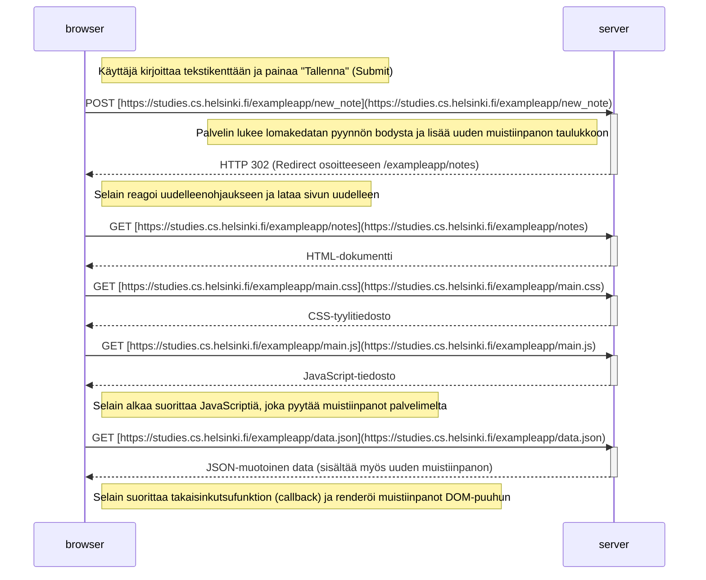

```mermaid
sequenceDiagram
    participant browser
    participant server

    Note right of browser: Käyttäjä kirjoittaa tekstikenttään ja painaa "Tallenna" (Submit)

    browser->>server: POST [https://studies.cs.helsinki.fi/exampleapp/new_note](https://studies.cs.helsinki.fi/exampleapp/new_note)
    activate server
    Note left of server: Palvelin lukee lomakedatan pyynnön bodysta ja lisää uuden muistiinpanon taulukkoon
    server-->>browser: HTTP 302 (Redirect osoitteeseen /exampleapp/notes)
    deactivate server

    Note right of browser: Selain reagoi uudelleenohjaukseen ja lataa sivun uudelleen

    browser->>server: GET [https://studies.cs.helsinki.fi/exampleapp/notes](https://studies.cs.helsinki.fi/exampleapp/notes)
    activate server
    server-->>browser: HTML-dokumentti
    deactivate server

    browser->>server: GET [https://studies.cs.helsinki.fi/exampleapp/main.css](https://studies.cs.helsinki.fi/exampleapp/main.css)
    activate server
    server-->>browser: CSS-tyylitiedosto
    deactivate server

    browser->>server: GET [https://studies.cs.helsinki.fi/exampleapp/main.js](https://studies.cs.helsinki.fi/exampleapp/main.js)
    activate server
    server-->>browser: JavaScript-tiedosto
    deactivate server

    Note right of browser: Selain alkaa suorittaa JavaScriptiä, joka pyytää muistiinpanot palvelimelta

    browser->>server: GET [https://studies.cs.helsinki.fi/exampleapp/data.json](https://studies.cs.helsinki.fi/exampleapp/data.json)
    activate server
    server-->>browser: JSON-muotoinen data (sisältää myös uuden muistiinpanon)
    deactivate server

    Note right of browser: Selain suorittaa takaisinkutsufunktion (callback) ja renderöi muistiinpanot DOM-puuhun
```
