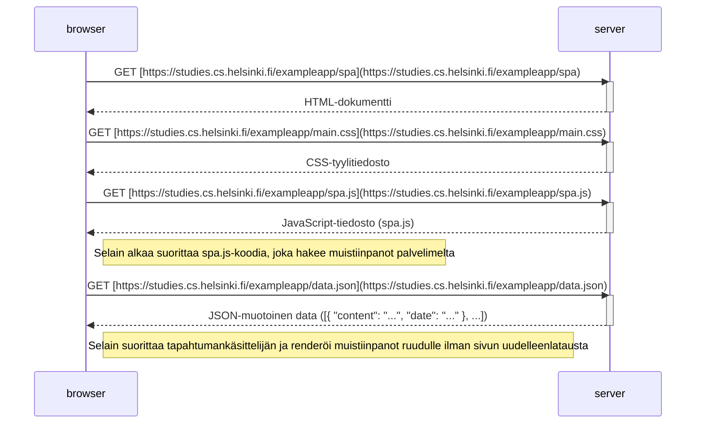

```mermaid
sequenceDiagram
    participant browser
    participant server

    browser->>server: GET [https://studies.cs.helsinki.fi/exampleapp/spa](https://studies.cs.helsinki.fi/exampleapp/spa)
    activate server
    server-->>browser: HTML-dokumentti
    deactivate server

    browser->>server: GET [https://studies.cs.helsinki.fi/exampleapp/main.css](https://studies.cs.helsinki.fi/exampleapp/main.css)
    activate server
    server-->>browser: CSS-tyylitiedosto
    deactivate server

    browser->>server: GET [https://studies.cs.helsinki.fi/exampleapp/spa.js](https://studies.cs.helsinki.fi/exampleapp/spa.js)
    activate server
    server-->>browser: JavaScript-tiedosto (spa.js)
    deactivate server

    Note right of browser: Selain alkaa suorittaa spa.js-koodia, joka hakee muistiinpanot palvelimelta

    browser->>server: GET [https://studies.cs.helsinki.fi/exampleapp/data.json](https://studies.cs.helsinki.fi/exampleapp/data.json)
    activate server
    server-->>browser: JSON-muotoinen data ([{ "content": "...", "date": "..." }, ...])
    deactivate server

    Note right of browser: Selain suorittaa tapahtumankäsittelijän ja renderöi muistiinpanot ruudulle ilman sivun uudelleenlatausta
```
