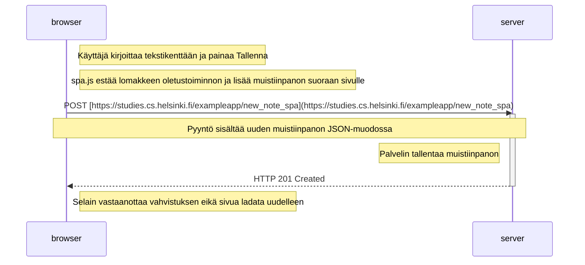

```mermaid
sequenceDiagram
    participant browser
    participant server

    Note right of browser: Käyttäjä kirjoittaa tekstikenttään ja painaa Tallenna

    Note right of browser: spa.js estää lomakkeen oletustoiminnon ja lisää muistiinpanon suoraan sivulle

    browser->>server: POST [https://studies.cs.helsinki.fi/exampleapp/new_note_spa](https://studies.cs.helsinki.fi/exampleapp/new_note_spa)
    activate server
    Note over browser,server: Pyyntö sisältää uuden muistiinpanon JSON-muodossa
    Note left of server: Palvelin tallentaa muistiinpanon
    server-->>browser: HTTP 201 Created
    deactivate server

    Note right of browser: Selain vastaanottaa vahvistuksen eikä sivua ladata uudelleen
```
